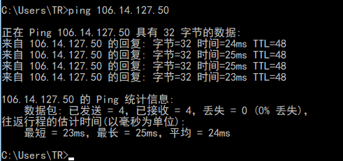
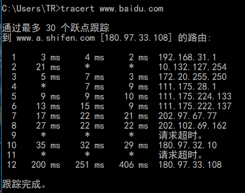
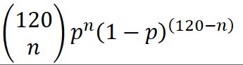
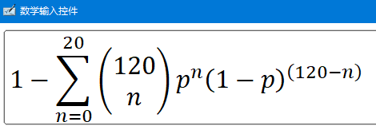
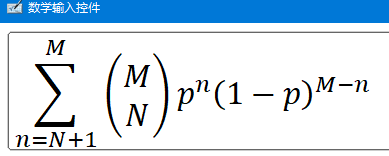
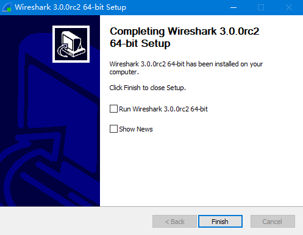

### 2016302580242 刘瑞康

----

---

---

### 8

a. 20

b. 10%

c. 

d. 

the result is 0.003

### 9

a. N = 1Gbps / 100kbps = 10000

b. 

### 10

dall = L / R1  + L / R2  + L / R3  + d1 / s 1 + d2 / s 2 + d3 / s 3  + dproc * 2

for the given value, dall = 64 ms

---

